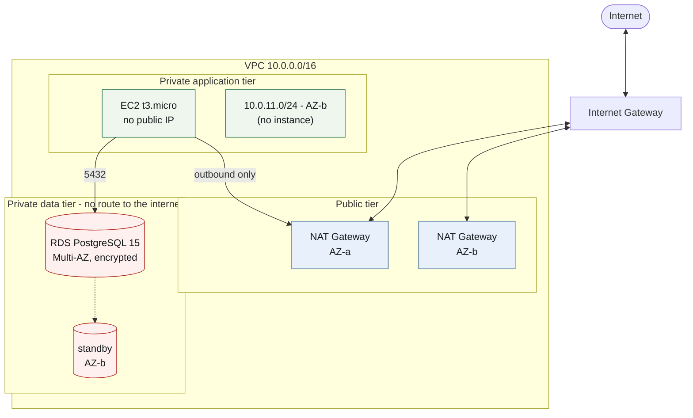

# Secure Multi-AZ Network Baseline with a Private PostgreSQL Tier

Terraform for the part of an AWS environment that has to be right before any
application is deployed on it: a three-tier VPC across two Availability Zones,
outbound-only internet access for private workloads, and a Multi-AZ PostgreSQL
database that nothing outside its own application tier can reach.

`terraform apply` creates 27 resources.

## Architecture



| Tier | Subnets | Route to the internet |
|---|---|---|
| Public | `10.0.1.0/24` AZ-a · `10.0.2.0/24` AZ-b | Internet Gateway, both directions |
| Private application | `10.0.10.0/24` AZ-a · `10.0.11.0/24` AZ-b | Outbound only, through the NAT Gateway in its own AZ |
| Private data | `10.0.20.0/24` AZ-a · `10.0.21.0/24` AZ-b | **None.** Its route table has no routes at all |

Every tier is created with `count = 2`, one subnet per Availability Zone.

## Design decisions

**One NAT Gateway per Availability Zone.** A single shared NAT is half the price,
but it makes one AZ a dependency of the other: if it fails, instances in the
surviving zone keep running and lose all outbound access. Here each private-app
subnet routes through the NAT in its own zone, so a zone failure stays inside
that zone. It costs about $33 a month more, and it is the largest single line in
the bill.

**The data tier has no route to the internet, in either direction.** Not filtered
— absent. `aws_route_table.private_db` is declared with no `route` block at all.

**No egress rules on the database security group.** Security groups are stateful,
so replies to the application tier still flow; what the database cannot do is
open a connection of its own. If it is ever compromised, there is no path out for
the data. This is the opposite of an oversight, and it is documented in the code.

**The master password is generated by RDS, not by Terraform.** A Terraform
variable — even one marked `sensitive = true` — is still written in plaintext
into `terraform.tfstate`. `manage_master_user_password = true` has RDS create the
password and hold it in AWS Secrets Manager, so it exists in neither the
repository nor the state file, and it can be rotated.

## Security controls

See [Security.md](Security.md) for the same list with file and line references.

- Application tier: HTTP accepted only from inside the VPC CIDR; SSH only from
  the operator's own address, passed in as a variable.
- Database tier: PostgreSQL `5432` accepted only from the application security
  group, by group ID rather than by CIDR.
- The application instance runs in a private subnet with `associate_public_ip_address = false`.
- RDS: `publicly_accessible = false`, `storage_encrypted = true`, `multi_az = true`.

## Known limitations

This is a network and data baseline, not a finished application. What it does not
do, deliberately or otherwise:

- **There is one EC2 instance and no Auto Scaling Group**, so the compute tier is
  not highly available even though the network and the database are.
- **There is no load balancer.** Nothing distributes traffic and nothing terminates
  TLS; the security group opens port 80 in plain HTTP inside the VPC.
- **The instance has no `user_data`.** It is a bare Amazon Linux 2023 host with
  nothing listening. There is no URL to visit after `terraform apply`.
- **RDS storage is encrypted with the AWS-managed key** (`aws/rds`), not a
  customer-managed KMS key with its own rotation policy.
- **A single NAT still processes all outbound traffic for its zone.** There is no
  VPC endpoint, so calls to S3 and other AWS services leave through the NAT and
  are billed per gigabyte.

## Cost

See [Costs.md](Costs.md) for the full breakdown. Roughly **$112 a month** in
`us-east-1`, and **none of it is covered by the AWS free tier**. The two NAT
Gateways with their Elastic IPs cost $73, which is more than twice what the
Multi-AZ database costs.

Run `terraform destroy` when you are finished.

## Deployment

```bash
cp terraform.tfvars.example terraform.tfvars
# edit terraform.tfvars: your public IP and an existing EC2 key pair
terraform init
terraform plan
terraform apply
```

`my_ip` must be in CIDR form — `curl ifconfig.me` gives you the address, and the
suffix is `/32`. `key_name` must name a key pair that already exists in the
region. The AMI is resolved by a data source, so no AMI ID is pinned.

## What I would change at scale

- Put an Application Load Balancer in the public subnets with an ACM certificate,
  redirect 80 to 443, and narrow the application security group to the load
  balancer's security group instead of the VPC CIDR.
- Replace the single instance with an Auto Scaling Group across both private
  application subnets, so the compute tier matches the availability of the rest.
- Add a gateway VPC endpoint for S3, so that traffic stops paying NAT data
  processing charges, and interface endpoints for Systems Manager so the instance
  can be administered without SSH at all.
- Split this single `main.tf` into `vpc.tf`, `security.tf`, `database.tf` and
  `compute.tf`, and move remote state into S3 with DynamoDB locking.
- Encrypt RDS with a customer-managed KMS key so key rotation and access to the
  key are auditable separately from the database itself.
